# iOS 27-inspired visual pass — review

Validated on Xcode 26.6 (17F113), iPhone 17 Pro simulator / iOS 26.5.
Deployment stays iOS 26.0. “iOS 27” is aesthetic direction; no iOS 27-only
API is assumed. Native SwiftUI tabs, forms, sheets and glass remain in charge.

## Evidence

- Simulator build succeeded, including AppIcon compilation and widget embedding.
- Existing suite: **70 tests passed**, 0 failures with `-testLanguage en
  -testRegion US`. The unqualified command on this Czech simulator fails four
  existing tests that assert English localized text (APIErrorContextTests and
  TaskFilterTests); no model/API/test code was changed to mask this.
- Final build succeeded after the additional Czech catalog entries.
- Original opaque 1024 × 1024 light/dark/tinted icons replace all catalog images.
  `scripts/render-icons.sh` reproduces the assets from the three root SVGs.
- Pixel review: Czech login, Settings account/privacy, live dashboard, download
  list, progress detail, Add download and connection recovery in both appearances.
  Review caught missing localized helper labels, low-contrast live throughput,
  raw dashboard titles and a redundant completed seeder progress bar; corrected.

These are **synthetic UI review captures**, not a live NAS session. A temporary
local harness populated the existing stores with `archive.local`, an 18.4 MB/s
transfer, a seeder, completed tasks and an error; it disabled restore/polling for
capture. The harness and its store/session edits were removed before the final
build and are not shipped. Detail was hosted as a root NavigationStack and
Settings/Add as roots, so these captures do not demonstrate sheet drag or back
navigation. The shipping presentation remains native.

## Remaining device checks

- Real NAS: sign in / OTP, pause/resume, upload, destination navigation and reconnect.
- Full VoiceOver, largest Dynamic Type, landscape/iPad and Reduce Transparency audit.
  Live status pulse now honors Reduce Motion; this is not a complete accessibility sign-off.
- Settings below the first viewport, keyboard-open Add/login, and empty/expired-
  session/certificate variants need an interactive device walkthrough.
- Existing Czech plural rules and unrelated localization gaps remain separate work.
- No TestFlight archive or release/version bump was requested.

## Captures

| Surface | Light | Dark |
|---|---|---|
| login | 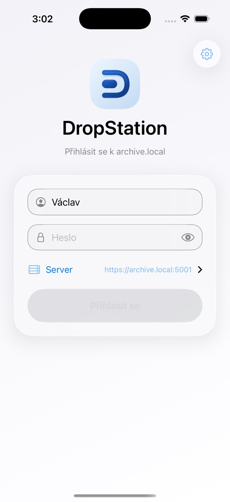 | 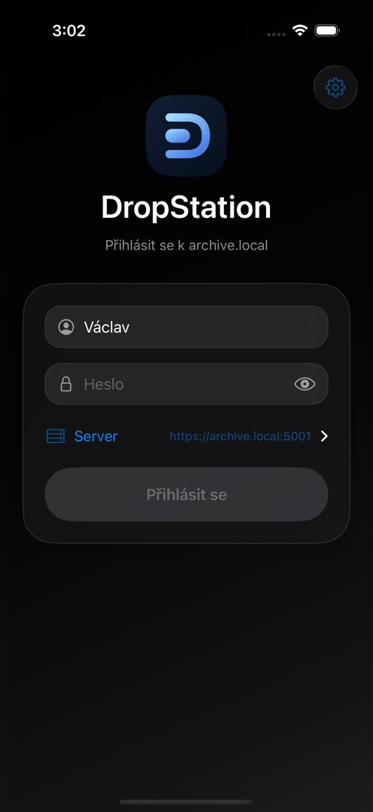 |
| dashboard | 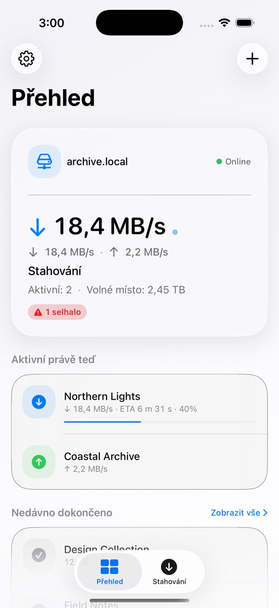 | 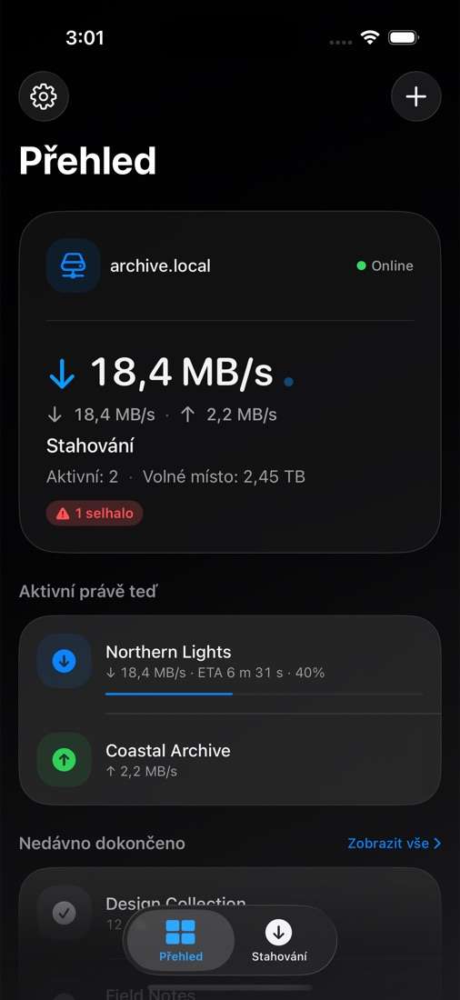 |
| downloads | 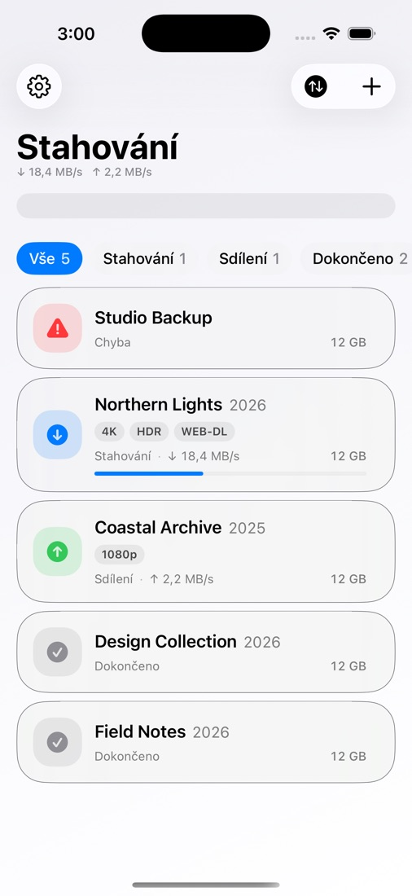 | 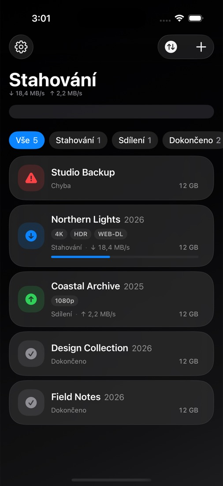 |
| detail | 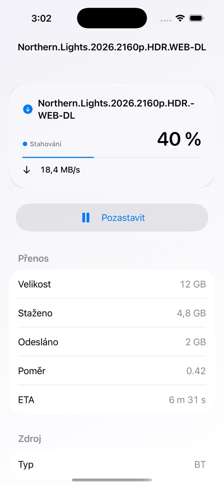 | 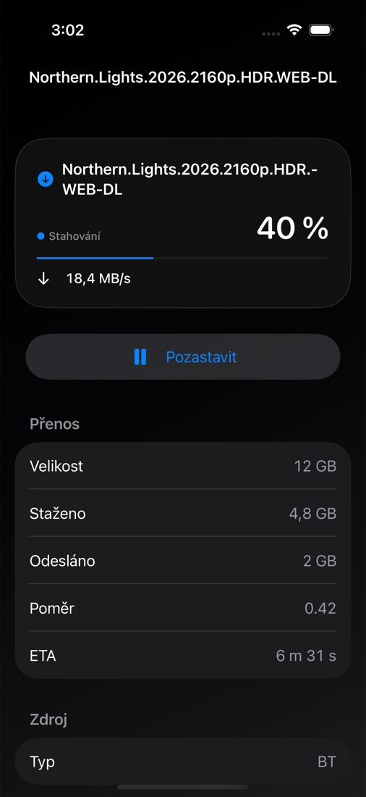 |
| add | 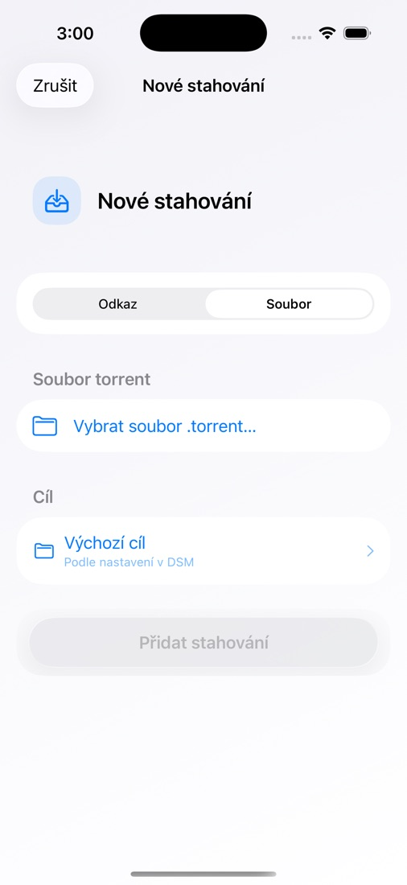 | 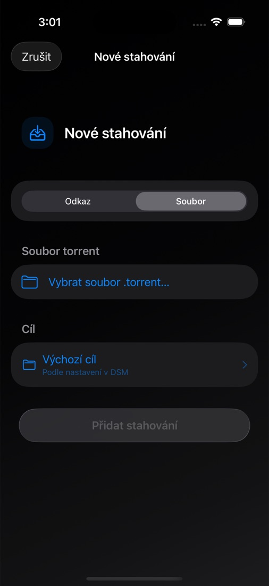 |
| settings | 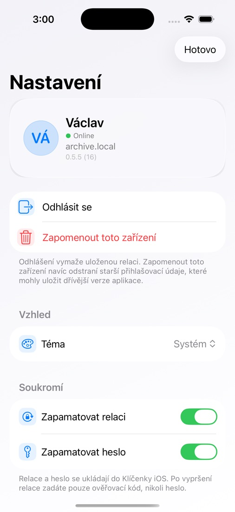 | 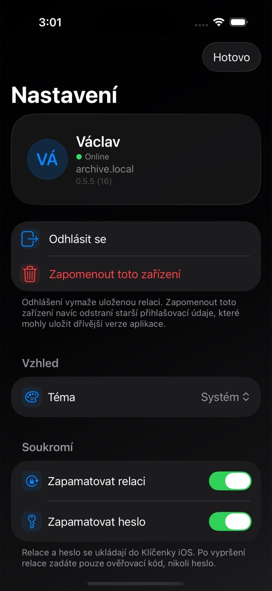 |
| recovery | 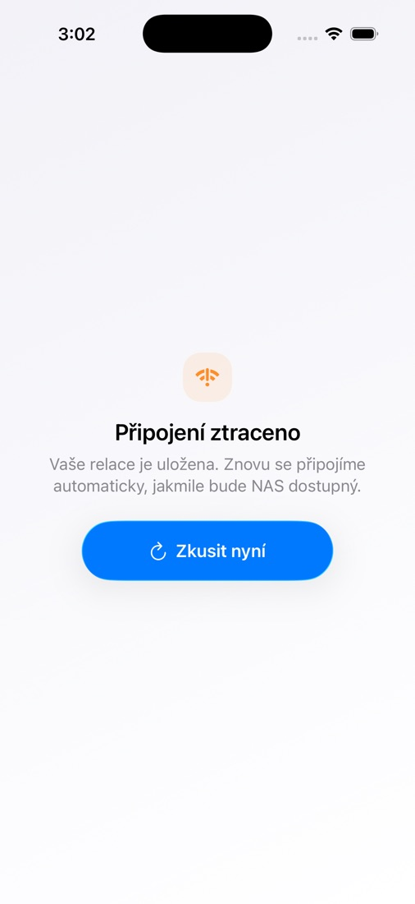 | 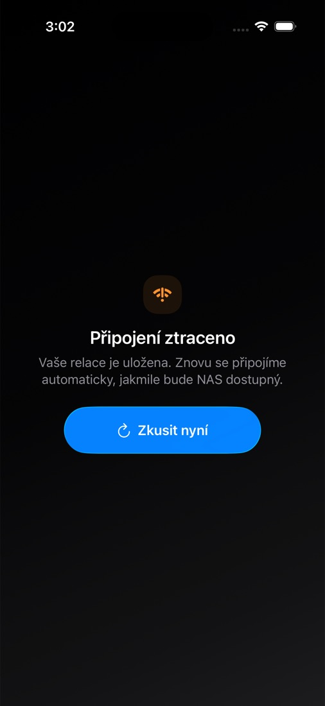 |
